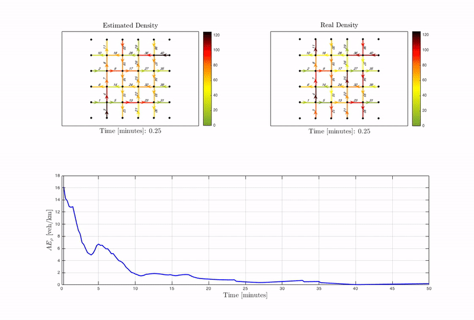

```{r setup, include=FALSE}
knitr::opts_chunk$set(echo = TRUE)
```

# ITS for Smart Mobility {-}

(ref:car) New connected vehicles [https://pixabay.com](Taken from: https://pixabay.com). 

```{r car, fig.cap='(ref:car)', fig.align = 'center', fig.width = 4, echo= FALSE}
knitr::include_graphics("images/01-car.jpg")
```

## Context {-}

Traffic congestion on urban roads is a problem of great interest nowadays since it strongly affects security and pollution.  Workfoce centralization, population and economic growth alongside with continuous urbanization are the main causes of traffic congestion. As cities strive to update/expand the current infrastructures the development of Information Technologies bring new possiblities as an alternative solution for transportation systems. 

The current project aims to explore some of the new technologies used in the so called Intelligent Transportation Systems (ITS). They objective is to study to a certain level of detail some of the new traffic management systems that will conduct new ways of transportation in the XXI century. The general idea is based on the fact that information collected by sensors within traffic networks or in-vehicles sensors can collect information regarding the traffic condition, perform estimation of unknown traffic states and decide on specific actions to modify this state.  

Specially, in this case the project will be focused in four main activities: 

- **Trafic signal design:** This projects aims to study how to optimally deal with the design of light cycles to optimize the traffic performance. Based on information collected by infrastructure based sensors the traffic state can be determined and specific decisions in terms on green/red light times can be dynamically adapted. 
- **Connected & automated vehicles:**  New in-vechicle sensors create situations in which vehicles may exchange information to improve traffic conditions. This project aims to study control algorithms implemented in the V2V (Vehicle-vehicle) communication layer that can be used to design traffic decisions. 
- **Eco-driving:** Connectivity between vehicles and infrastructures will define future directions in transportation. Shared information in the V2I (Vehicle-infrastructure) I2V (Infrastructure-vehicle) communication layers can optimize traffic conditions in apects like fuel-efficiency.  
- **Traffic variable reconstruction:** Sensors installed in traffic infrastructures provide information regarding the traffic state. Nevertheless the solution is not scalable to cover large cities due to the economical leverage required to deploy this technology. Algorithms to reconstruct traffic information may provide a  promising future for accurately determine the traffic state of a city. The aim of this project is to study how multiple sources of information can be integrated to reconstruct traffic variables within a city.  

## General Objectives {-}

* Identify new technologies implemented in the Intelligent Transporation Systems and investigate how these technologies are deployed in real systems. 
* Define and determine adequate models that are suitable for deploying new ITS technologies. 
* Develop specific solutions for ITS that can be tested under pre-defined scenarios. 


<!--chapter:end:index.Rmd-->

# Project information

## Deliverables {-}

The project is mainly composed in 3 phases.

1. **Problem identification & literature review:** This phases consists in: 

   1. Identify particularly the problem under study, meaning the system to be controlled and the way it is assesed. 

   2. Retrieve bibliographical information about the problem under study. 

   3. Summarize the already proposed alternatives in the existing literature. 

   The main objective of this phase is to understand what are the main challenges when solving the specific project under study and to present in general ways how this problem has been solved. 

2. **Setting up a suitable model:** Once the problem has been identified the main objective is to precisely describe the traffic models that are suitable for the approach. For this phase the stages are divided as: 

   1. Determine a specific traffic model that can be used for the corresponding situation 
   2. Define the scenario in which the solution should be tested 
   3. Pre establish parameters and requirements for the solution to be implemented. 

3. **Experimental results:**  Finally, the main objective is to perform a validation and solution for the problem under study. Several tools are provided for this purpose like micro/macro 

***

## Reporting {-}

In order to fullfill the requirements for each phase each group should provide a report as follows:

- *Report 1:* Summarizes the results of the 1. Problem identification & literature review and 2. Setting up a suitable model. (***Due date: January 9th, 2018***)

* *Report 2:* Summarizes the results of the phase 3.Experimental results (***Due date: January 23rd, 2019***)

<!--chapter:end:01-general.Rmd-->

# Project 1: Signalized Traffic

The main objective of this project is to design *traffic light signal* controls in order to optimize particular traffic conditions. Traffic signals regularly pre-establish fixed values *red* or *green* for a particular intersection. In fact the behavior can be modeled as: 

(ref:tlight) Traffic light signal example. 

```{r tlight, fig.cap='(ref:tlight)', fig.align = 'center', fig.width = 3.5, fig.asp= 0.7, echo= FALSE}
library(ggplot2)
N <- 1 # samples 
x <- c(seq(from = 1,  to = 30,  by = N),
       seq(from = 30, to =  60,  by = N),
       seq(from = 60, to =  90,  by = N),
       seq(from = 90, to =  120, by = N))
y <- c(rep(0, 30), rep(1, 31),rep(0, 31), rep(1, 31))
df <- data.frame(c(list(x),list(y)))
names(df) <- c("Time", "Light")
ggplot(data=df,aes(x=Time,y=Light))+geom_path() + 
  geom_hline(aes(yintercept=mean(Light)), color = "Red") + 
  labs(x='Time (s)', y = 'Light (Green/Red)')
```


The relationship between the switched green/red time in a traffic light can be represented by a pulse signal (Figure \@ref(fig:tlight)). The red line in the figure represents the *duty cycle* which represents the fraction of time the light was in green ($1$) with respect to the total cycle time ($60s$). In this case, the main objective is to study traffic models that can model signalized intersections and design control laws to design. 

***

## Objectives {-}

The main objective of this project is to: 

1. Study the fundamental aspects of traffic signal control strategies. 
2. Obtain and simulate a macroscopic traffic model for a urban network with traffic signals 
3. Create and design control strategies applied via traffic signals in urban traffic networks. 
4. Compare the behavior of fixed time traffic signal polices and dynamic time traffic signal polices. 

## Description {-}

### Task 1: Modeling {-}

Check models for macroscopic networks, determine the parameters for a network and present why these parameters. 

#### Context {-}

#### Questions {-}

#### Expected outcomes {-}

Implement a basic simulation scenario where 

### Task 2: Simulation {-}

#### Context {-}

#### Questions {-}

#### Expected outcomes {-}

### Task 3: Control strategy {-}

#### Context {-}

#### Questions {-}

#### Expected outcomes {-}

### Task 4: Performance evaluation {-}

#### Context {-}

#### Questions {-}

#### Expected outcomes {-}


### Fundamentals on Macroscopic traffic flow modeling {-}

Traffic control networks can be regularly modeled via: 

### 

## Sources {-}

For more details on the project please check: 

- [Traffic Macrosimulator - Github](https://github.com/andres-ladino-ifsttar/traffic-macrosimulator)

- Check [@Grandinetti2015] available [Link](https://hal.archives-ouvertes.fr/hal-01188535) and [@Grandinetti2016] [Link](https://hal.archives-ouvertes.fr/hal-01188811)

<!--chapter:end:02-signal-traffic.Rmd-->

# Project 2: Vehicle Platooning

## Objectives {-}

This project consists in works based on [@Grandinetti2015]

## Description {-}

## Sources {-}

- [Simulation results - Github](https://github.com/aladinoster/density-reconstruction)

- Check [@Duret2019] available [Link](http://bit.ly/Hierarchical_ISTTT)

<!--chapter:end:03-vehicle-platoon.Rmd-->

# Project 3: Connected Vehicles

## Objectives {-}

This project consists in works based on [@Grandinetti2015]

## Description {-}

## Sources {-}

<!--chapter:end:04-connected-vehicles.Rmd-->

# Project 4: Density Reconstruction



(ref:foo) A scatterplot of the data `cars` using **base** R graphics. 

```{r foo, fig.cap='(ref:foo)'}
plot(cars)  # a scatterplot
```

\begin{equation}
f\left(k\right)=\binom{n}{k}p^k\left(1-p\right)^{n-k} (\#eq:binom)
\end{equation}


In \@ref(eq:binom)


Below is an `align` environment \@ref(eq:align):

```latex
\begin{align} 
g(X_{n}) &= g(\theta)+g'({\tilde{\theta}})(X_{n}-\theta) \notag \\
\sqrt{n}[g(X_{n})-g(\theta)] &= g'\left({\tilde{\theta}}\right)
  \sqrt{n}[X_{n}-\theta ] (\#eq:align)
\end{align} 
```

\begin{align}
g(X_{n}) &= g(\theta)+g'({\tilde{\theta}})(X_{n}-\theta) \notag \\
\sqrt{n}[g(X_{n})-g(\theta)] &= g'\left({\tilde{\theta}}\right)
  \sqrt{n}[X_{n}-\theta ] (\#eq:align)
\end{align}

## Sources {-}

For more details on the project please check: 

- [Simulation results - Github](https://github.com/aladinoster/density-reconstruction)

- Check [@Ladino2018] available [Link](https://hal.archives-ouvertes.fr/hal-01731356) and [@Lovisari2016] [Link](https://hal.archives-ouvertes.fr/hal-01375928)

## Reference {-}

The main reference for this project is [@Ladino2018]

<!--chapter:end:05-density-estimate.Rmd-->

`r if (knitr:::is_html_output()) '
# References {-}
'`

<!--chapter:end:06-references.Rmd-->

